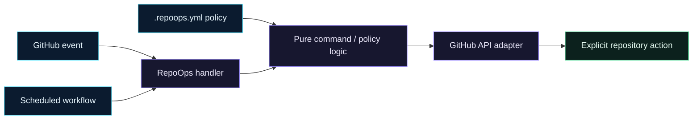

<p align="center">
  
</p>

<h1 align="center">RepoOps</h1>

<p align="center">
  <strong>Open-source IssueOps and repository-operations automation for GitHub maintainers.</strong><br />
  Turn GitHub events and explicit commands into deterministic, testable workflows without hiding consequential decisions from humans.
</p>

<p align="center">
  <a href="https://github.com/gODtECH-Ctl-Create/RepoOps/actions/workflows/ci.yml"></a>
  <a href="https://github.com/gODtECH-Ctl-Create/RepoOps/actions/workflows/pages.yml"></a>
  <a href="package.json"></a>
  <a href="https://github.com/gODtECH-Ctl-Create/RepoOps/issues?q=is%3Aissue+is%3Aopen+label%3A%22good+first+issue%22+label%3A%22status%3A+ready%22+no%3Aassignee"></a>
  <a href="https://github.com/gODtECH-Ctl-Create/RepoOps/graphs/contributors"></a>
  <a href="LICENSE"></a>
</p>

<p align="center">
  <a href="https://godtech-ctl-create.github.io/RepoOps/"><strong>Website</strong></a>
  &nbsp;•&nbsp;
  <a href="https://godtech-ctl-create.github.io/RepoOps/contribute.html"><strong>Contributor Hub</strong></a>
  &nbsp;•&nbsp;
  <a href="docs/"><strong>Docs</strong></a>
  &nbsp;•&nbsp;
  <a href="docs/roadmap.md"><strong>Roadmap</strong></a>
  &nbsp;•&nbsp;
  <a href="SECURITY.md"><strong>Security</strong></a>
</p>

> [!TIP]
> **New to RepoOps?** Start in the [Contributor Hub](https://godtech-ctl-create.github.io/RepoOps/contribute.html). It shows genuinely available work without requiring you to memorize the repository's label taxonomy.

---

## ⚡ Why RepoOps?

GitHub already gives maintainers issues, pull requests, checks, reviews, and automation. The missing piece is often the **operational follow-through between those events**.

| Maintainer pressure | RepoOps response |
| --- | --- |
| Claimed work quietly goes stale | Track assignment lifecycle, reminder policy, and linked implementation work |
| Ready, blocked, and active work blur together | Enforce deterministic workflow-state transitions |
| GitHub retries or duplicate deliveries repeat mutations | Use idempotent operations and durable receipts |
| PRs sit open for different reasons | Build explicit maintainer-attention states and queues |
| Contributors cannot tell what is safe to pick up | Surface live ready work through the Contributor Hub |
| Automation changes repository state without enough context | Keep decisions testable and build toward auditable operational history |

> **GitHub remains the source of truth.** RepoOps coordinates repository operations; it does not replace issues, pull requests, reviews, branch rules, or CI.

## 🛰️ Live project surfaces

| | Surface | Use it for |
| --- | --- | --- |
| 🌐 | [**Website**](https://godtech-ctl-create.github.io/RepoOps/) | Product overview, live Good First Issues, live contributors, architecture, roadmap |
| 🧭 | [**Contributor Hub**](https://godtech-ctl-create.github.io/RepoOps/contribute.html) | Filter work by readiness, difficulty, area, and priority |
| 🌱 | [**Good First Issues**](https://github.com/gODtECH-Ctl-Create/RepoOps/issues?q=is%3Aissue+is%3Aopen+label%3A%22good+first+issue%22+label%3A%22status%3A+ready%22+no%3Aassignee) | Open, unassigned starter work marked ready |
| ✅ | [**All ready issues**](https://github.com/gODtECH-Ctl-Create/RepoOps/issues?q=is%3Aissue+is%3Aopen+label%3A%22status%3A+ready%22+no%3Aassignee+-label%3A%22status%3A+blocked%22) | Claimable work across difficulty levels |
| 🤝 | [**Help wanted**](https://github.com/gODtECH-Ctl-Create/RepoOps/issues?q=is%3Aissue+is%3Aopen+label%3A%22help+wanted%22) | Open work where additional contribution is welcome |
| 👥 | [**Live contributors**](https://godtech-ctl-create.github.io/RepoOps/#contributors) | Public repository contribution activity without contributor ranking |

## 🧠 How RepoOps works



The architecture keeps event parsing, decisions, and GitHub mutations separate so core behavior can be tested without making live API calls. See the [architecture guide](docs/architecture.md).

## ✅ Available now

| Foundation | Status |
| --- | --- |
| `/claim` and `/unclaim` | ✅ Implemented |
| `status: ready` ↔ `status: in-progress` lifecycle | ✅ Implemented |
| Safe close-event cleanup | ✅ Implemented |
| Configurable reminder / expiry policy | ✅ Implemented |
| Idempotency helpers + operation receipts | ✅ Implemented |
| Linked pull-request detection | ✅ Implemented |
| Strict `.repoops.yml` validation | ✅ Implemented |
| Event fixtures + local simulation | ✅ Implemented |
| GitHub Pages product site + contributor hub | ✅ Implemented |
| Scheduled stale-assignment reminders | ✅ Implemented — reminder-only |
| Contributor work limits / PR attention / event history | 🗺️ Roadmap |

> [!IMPORTANT]
> RepoOps currently defaults to **non-destructive assignment behavior**. `autoRelease` is `false`; automatic destructive release is not part of the current workflow.

### Commands

| Command | Behavior |
| --- | --- |
| `/claim` | Claims an available issue, removes `status: ready`, and applies `status: in-progress` |
| `/unclaim` | Releases the caller's assignment and restores readiness only when the issue is genuinely available |

Planned command work includes `/keep`, `/blocked`, and `/ready`. See [docs/commands.md](docs/commands.md).

## ⚙️ Repository policy

RepoOps reads repository behavior from `.repoops.yml`:

```yaml
commands:
  claim: true
  unclaim: true

labels:
  inProgress: "status: in-progress"
  ready: "status: ready"

assignments:
  reminderAfterDays: 3
  expireAfterDays: 7
  autoRelease: false
```

Unknown sections, unknown keys, unsafe values, and contradictory lifecycle policy are rejected rather than silently ignored. See [docs/configuration.md](docs/configuration.md).

## 🤝 Contribute

You do not have to arrive with a code change already chosen.

| Path | Start here | What happens next |
| --- | --- | --- |
| 🧭 **Pick existing work** | [Contributor Hub](https://godtech-ctl-create.github.io/RepoOps/contribute.html) | Pick genuinely ready work, open it on GitHub, then comment `/claim` |
| 🧩 **Propose a problem** | [Problem proposal form](https://github.com/gODtECH-Ctl-Create/RepoOps/issues/new?template=problem.yml) | Describe a real maintainer/repository-operations pain point; it is triaged before becoming claimable |
| 🚀 **Propose an upgrade** | [Feature / upgrade form](https://github.com/gODtECH-Ctl-Create/RepoOps/issues/new?template=feature.yml) | Suggest a meaningful capability or improvement grounded in a real workflow |

A new proposal is **not** automatically approved, assigned, or labeled `status: ready`.

### Contributor quick start

```text
find ready work → /claim → focused branch → npm run check → PR → review → merge
```

1. Read [CONTRIBUTING.md](CONTRIBUTING.md) and the [development guide](docs/development.md).
2. Open the [Contributor Hub](https://godtech-ctl-create.github.io/RepoOps/contribute.html).
3. Choose an open, unassigned issue carrying `status: ready`.
4. Comment `/claim` on GitHub.
5. Implement only the issue scope and run `npm run check`.
6. Open a focused pull request with validation evidence.

Do not start substantial work on blocked or already-claimed issues unless a maintainer explicitly coordinates it.

## 🛠️ Local development

Requirements: **Node.js 20+** and Git.

```bash
git clone https://github.com/gODtECH-Ctl-Create/RepoOps.git
cd RepoOps
npm install
npm run check
```

Simulate supported GitHub events without mutating a live repository:

```bash
npm run simulate -- test/fixtures/claim-event.json
npm run simulate -- test/fixtures/closed-event.json
```

The runtime currently has no third-party dependencies.

## 🛡️ Design & safety principles

- **Human control for consequential decisions** — automation coordinates work without silently making destructive choices.
- **Least privilege** — workflows request only the permissions they need.
- **Deterministic core logic** — decisions are independently testable.
- **Safe retries** — repeated GitHub deliveries should not repeat successful operations.
- **Configuration before hard-coding** — repository policy is explicit.
- **Untrusted input stays untrusted** — contributor-controlled text is never executable control data.
- **GitHub remains authoritative** — RepoOps adds an operations layer instead of creating a competing issue/PR system.

Security-sensitive findings should follow [SECURITY.md](SECURITY.md).

## 🗺️ Roadmap

```text
IssueOps lifecycle
      ↓
Maintainer attention + PR operations
      ↓
Issue triage
      ↓
Operational history + repository health
      ↓
Reusable GitHub Action
      ↓
GitHub App + multi-repository control plane
      ↓
Dashboard and analytics
```

RepoOps is **pre-1.0**. Package version: **0.2.0**. No official GitHub Release has been published yet.

See the [product roadmap](docs/roadmap.md), [issue taxonomy](docs/issue-taxonomy.md), [release policy](docs/releases.md), and [changelog](CHANGELOG.md).

## Assignment safety and reminders

Claims transition ready → in-progress; unclaim restores ready when work is open
and available, and close clears active states. Repeated deliveries use authenticated
operation receipts. Scheduled reminders consider bot-authored assignment age and
explicit implementation PR links; they never automatically release work.

See [assignment configuration](docs/configuration.md), [retry recovery](docs/idempotency.md),
and [scanner operation and live validation](docs/stale-assignments.md).

The [versioned operational event contract](docs/events.md) defines immutable facts
and replay validation for future audit and history consumers. Audit emission and
persistent event storage remain separate work.

---

<p align="center">
  <strong>RepoOps</strong> · Repository operations that keep GitHub work moving.<br />
  <a href="https://godtech-ctl-create.github.io/RepoOps/">Website</a> ·
  <a href="https://godtech-ctl-create.github.io/RepoOps/contribute.html">Contribute</a> ·
  <a href="docs/roadmap.md">Roadmap</a> ·
  <a href="LICENSE">MIT License</a>
</p>
