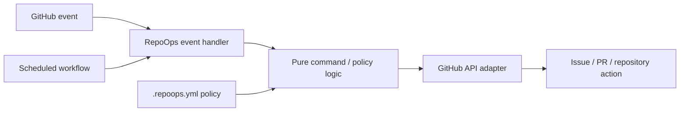

<div align="center">

# RepoOps

### Repository operations that keep GitHub work moving.

**RepoOps is an open-source IssueOps and repository-operations automation toolkit for GitHub maintainers.**

It turns GitHub events and explicit commands into safe, testable workflows for assignment lifecycle, contributor follow-up, maintainer attention, pull-request operations, and repository health.

[](https://github.com/gODtECH-Ctl-Create/RepoOps/actions/workflows/ci.yml)
[](https://github.com/gODtECH-Ctl-Create/RepoOps/actions/workflows/pages.yml)
[](package.json)
[](https://github.com/gODtECH-Ctl-Create/RepoOps/issues?q=is%3Aissue+is%3Aopen+label%3A%22good+first+issue%22+label%3A%22status%3A+ready%22+no%3Aassignee)
[](https://github.com/gODtECH-Ctl-Create/RepoOps/graphs/contributors)
[](LICENSE)

[**Website**](https://godtech-ctl-create.github.io/RepoOps/) · [**Contributor Hub**](https://godtech-ctl-create.github.io/RepoOps/contribute.html) · [**Docs**](docs/) · [**Roadmap**](docs/roadmap.md) · [**Security**](SECURITY.md)

</div>

---

## Why RepoOps?

Growing repositories create operational work that maintainers repeatedly reconstruct by hand.

| Maintainer problem | RepoOps direction |
| --- | --- |
| A contributor claims an issue and work quietly goes stale | Track assignment state, reminder policy, linked implementation work, and follow-up |
| Ready, blocked, and in-progress work becomes hard to distinguish | Maintain explicit workflow states and deterministic transitions |
| Repeated GitHub deliveries can duplicate repository mutations | Use reusable idempotency and retry-safe operation receipts |
| Pull requests sit open for different reasons | Classify who needs to act next and build maintainer attention queues |
| Contributors do not know what is actually safe to pick up | Surface live, filtered ready work through the contributor hub |
| Maintainers need to know what automation did and why | Build a normalized operational event and audit history |

RepoOps coordinates GitHub rather than replacing it. Issues, pull requests, checks, reviews, and repository policy remain the source of truth.

## Live project surfaces

| Surface | What it gives you |
| --- | --- |
| [**RepoOps website**](https://godtech-ctl-create.github.io/RepoOps/) | Product overview, live Good First Issues, live contributors, architecture and roadmap entry points |
| [**Contributor Hub**](https://godtech-ctl-create.github.io/RepoOps/contribute.html) | Filter ready work by state, difficulty, area, and priority without memorizing GitHub search syntax |
| [**Good First Issues**](https://github.com/gODtECH-Ctl-Create/RepoOps/issues?q=is%3Aissue+is%3Aopen+label%3A%22good+first+issue%22+label%3A%22status%3A+ready%22+no%3Aassignee) | Open, unassigned starter work currently marked ready |
| [**All ready issues**](https://github.com/gODtECH-Ctl-Create/RepoOps/issues?q=is%3Aissue+is%3Aopen+label%3A%22status%3A+ready%22+no%3Aassignee+-label%3A%22status%3A+blocked%22) | Claimable work across difficulty levels |
| [**Help wanted**](https://github.com/gODtECH-Ctl-Create/RepoOps/issues?q=is%3Aissue+is%3Aopen+label%3A%22help+wanted%22) | Open work where additional contribution is welcome |
| [**Live contributors**](https://godtech-ctl-create.github.io/RepoOps/#contributors) | Public repository contribution activity without contributor ranking or scoring |

## How RepoOps works



The architecture keeps event parsing, decisions, and GitHub mutations separate so core behavior can be tested without making live API calls.

Read the [architecture guide](docs/architecture.md) for the full model.

## Available now

RepoOps already has a working IssueOps foundation:

- `/claim` and `/unclaim`
- deterministic `status: ready` ↔ `status: in-progress` transitions
- safe close-event cleanup
- configurable assignment reminder and expiry policy
- non-destructive defaults (`autoRelease: false`)
- retry-safe idempotency helpers and operation receipts
- linked pull-request detection for claimed issues
- strict `.repoops.yml` validation
- GitHub event fixtures and local simulation
- automated repository label synchronization
- contributor, architecture, security, release, and development documentation
- live GitHub Pages product site and contributor hub

The scheduled stale-assignment reminder scanner is the current P0 work in progress. Automatic destructive assignment release is **not** part of the current behavior.

### Implemented commands

| Command | Behavior |
| --- | --- |
| `/claim` | Claims an available issue, removes `status: ready`, and applies `status: in-progress` |
| `/unclaim` | Releases the caller's assignment and restores readiness when the issue is genuinely available |

Planned command work includes `/keep`, `/blocked`, and `/ready`. See [docs/commands.md](docs/commands.md).

## Repository policy

RepoOps reads repository behavior from `.repoops.yml`.

```yaml
commands:
  claim: true
  unclaim: true

labels:
  inProgress: "status: in-progress"
  ready: "status: ready"

assignments:
  reminderAfterDays: 3
  expireAfterDays: 7
  autoRelease: false
```

Unknown sections, unknown keys, unsafe values, and contradictory lifecycle policy are rejected rather than silently ignored.

See the [configuration guide](docs/configuration.md).

## Contribute to RepoOps

There are three useful ways to enter the project:

| I want to... | Start here | What happens next |
| --- | --- | --- |
| **Pick existing work** | [Contributor Hub](https://godtech-ctl-create.github.io/RepoOps/contribute.html) | Choose genuinely ready work, open it on GitHub, then comment `/claim` |
| **Propose a problem** | [Problem proposal form](https://github.com/gODtECH-Ctl-Create/RepoOps/issues/new?template=problem.yml) | Describe a real maintainer/repository-operations pain point; maintainers triage it before it becomes claimable |
| **Propose an upgrade** | [Feature / upgrade form](https://github.com/gODtECH-Ctl-Create/RepoOps/issues/new?template=feature.yml) | Suggest a meaningful capability or improvement grounded in a real workflow |

A new proposal is **not** automatically approved, assigned, or labeled `status: ready`.

### Contributor quick start

1. Read [CONTRIBUTING.md](CONTRIBUTING.md) and the [development guide](docs/development.md).
2. Open the [Contributor Hub](https://godtech-ctl-create.github.io/RepoOps/contribute.html) or a filtered GitHub issue list.
3. Pick an open, unassigned issue carrying `status: ready`.
4. Comment:

   ```text
   /claim
   ```

5. Create a focused branch, implement the issue acceptance criteria, and run:

   ```bash
   npm run check
   ```

6. Open a focused pull request linked to the issue and include useful validation evidence.

Do not start substantial work on blocked or already-claimed issues unless a maintainer explicitly coordinates it.

## Local development

Requirements: **Node.js 20+** and Git.

```bash
git clone https://github.com/gODtECH-Ctl-Create/RepoOps.git
cd RepoOps
npm install
npm run check
```

Simulate supported GitHub events without mutating a live repository:

```bash
npm run simulate -- test/fixtures/claim-event.json
npm run simulate -- test/fixtures/closed-event.json
```

The runtime currently has no third-party dependencies.

## Current project status

RepoOps is still **pre-1.0** and the pre-contributor technical foundation is in progress.

| Foundation | Status |
| --- | --- |
| Command dispatcher + `/claim` / `/unclaim` | ✅ Implemented |
| Assignment policy + workflow-state transitions | ✅ Implemented |
| Idempotency / repeated-delivery safety | ✅ Implemented |
| Linked PR detection | ✅ Implemented |
| Scheduled stale-assignment reminders | 🚧 In progress |
| Contributor active-work limits | Planned |
| PR attention classifier / review queue | Planned |
| Operational event model / audit history | Planned |
| GitHub App / multi-repository control plane | Later roadmap |

Package version: **0.2.0**. No official GitHub Release has been published yet; release/versioning expectations are documented in [docs/releases.md](docs/releases.md), and user-visible changes are tracked in [CHANGELOG.md](CHANGELOG.md).

## Design and safety principles

- **Human control for consequential decisions** — automation should surface and coordinate work, not silently make destructive choices.
- **Least privilege** — workflows request only the permissions they need.
- **Deterministic core logic** — decisions should be independently testable.
- **Safe retries** — repeated GitHub deliveries should not duplicate successful operations.
- **Configuration before repository-specific hard-coding** — repositories need different policies.
- **Untrusted input stays untrusted** — contributor-controlled text is never treated as executable control data.
- **GitHub remains authoritative** — RepoOps adds an operations layer rather than creating a competing issue/PR system.

Security-sensitive findings should follow [SECURITY.md](SECURITY.md).

## Roadmap

RepoOps is being developed from IssueOps automation toward a broader repository-operations control plane:

```text
IssueOps lifecycle
      ↓
Maintainer attention + PR operations
      ↓
Issue triage
      ↓
Operational history + repository health
      ↓
Reusable GitHub Action
      ↓
GitHub App + multi-repository control plane
      ↓
Dashboard and analytics
```

See the detailed [product roadmap](docs/roadmap.md) and [issue taxonomy](docs/issue-taxonomy.md).

## License

RepoOps is released under the [MIT License](LICENSE).
